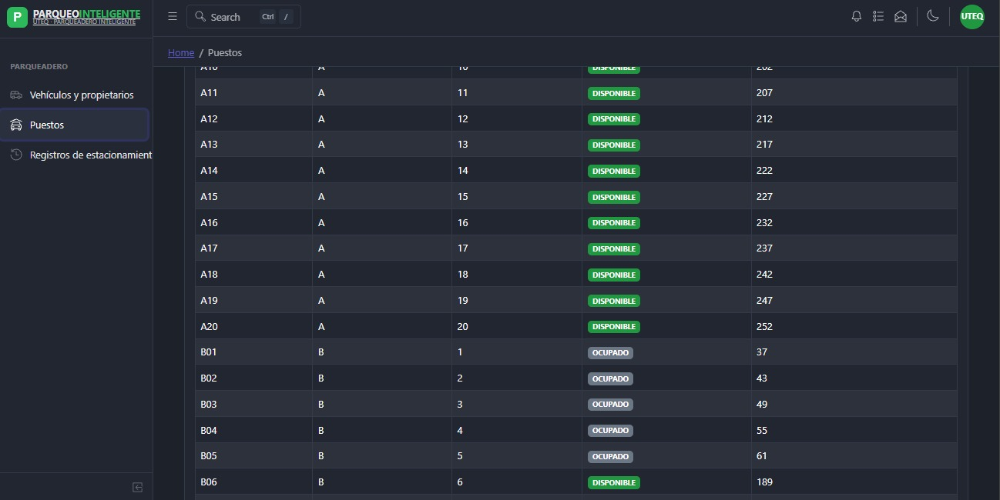
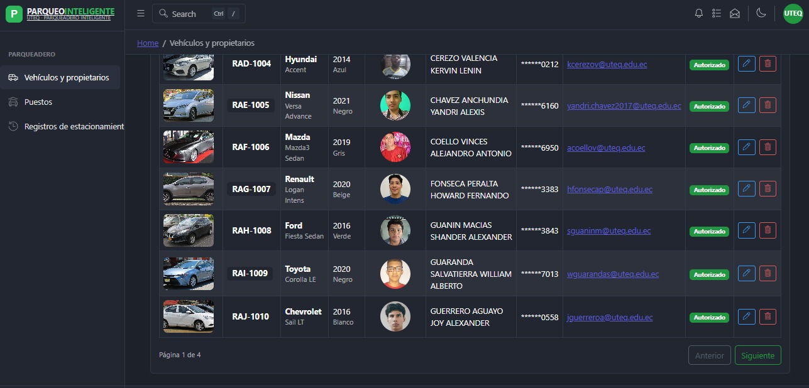
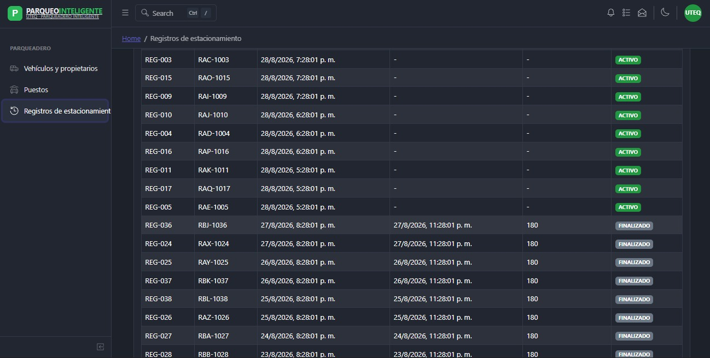

# PARQUEO INTELIGENTE UTEQ — CRUD de Vehículos, Puestos y Registros

Consola administrativa construida con **React + Vite**, **CoreUI** y **Supabase**
para el caso de estudio *UTEQ Smart Parking*.

Permite listar, buscar, paginar, **agregar**, **editar** y **eliminar** vehículos
junto con los datos de su propietario, y consultar en tiempo real el estado de
los puestos de parqueo y el historial de registros de estacionamiento.

> Asignatura: Aplicaciones Telemáticas Basadas en la Web — UTEQ

## Funcionalidades

### Vehículos y propietarios
Listado paginado (4 páginas) de vehículos con foto, placa, marca/modelo, año,
color, foto y nombre del propietario, teléfono (enmascarado), correo y estado
de autorización.
- Búsqueda por placa, marca, modelo, color, propietario o correo.
- Paginación ("Página 1 de 4", con botones Anterior/Siguiente).
- **Agregar** vehículo + propietario mediante formulario validado.
- **Editar** vehículo + propietario, precargando los datos actuales.
- **Eliminar** con modal de confirmación antes de borrar.
- Badge de estado **Autorizado** por vehículo.
- Mensajes de éxito/error (toasts), indicadores de carga y botones
  deshabilitados durante las operaciones.

### Puestos de parqueo
Listado en tiempo real de los 80 puestos, organizados en columnas/secciones
(A, B, C, D), cada uno con su código (p. ej. `A11`, `B05`), número dentro de
la sección y una lectura asociada al sensor ultrasónico simulado.
- Indicador visual de disponibilidad: **DISPONIBLE** (verde) / **OCUPADO** (gris).
- Actualización automática del estado según la simulación de sensores.

### Registros de estacionamiento
Historial de entradas y salidas por placa, con código de registro (`REG-XXX`),
fecha/hora de entrada, fecha/hora de salida, duración en minutos y estado.
- Estado **ACTIVO**: el vehículo sigue estacionado (sin hora de salida ni duración).
- Estado **FINALIZADO**: muestra hora de salida y la duración total en minutos.
- Ordenado por fecha, del registro más reciente al más antiguo.

## Capturas

| Vehículos y propietarios | Puestos | Registros de estacionamiento |
|---|---|---|
|  |  |  |

## Estructura del proyecto

\`\`\`text
SmartParkingUTEQ/
├── .env.local
├── supabase_parqueadero_uteq.sql
├── supabase_parqueadero_uteq_crud_rls.sql
├── supabase_puestos_registros_rls.sql
└── src/
    ├── lib/supabase.js
    ├── hook/
    │   ├── useVehiculos.js
    │   ├── usePuestos.js
    │   └── useRegistros.js
    ├── views/parqueadero/
    │   ├── ListaVehiculos.jsx
    │   ├── VehiculoFormModal.jsx
    │   ├── EliminarVehiculoModal.jsx
    │   ├── vehiculoValidacion.js
    │   ├── ListaPuestos.jsx
    │   └── ListaRegistros.jsx
    ├── components/BrandSmartParking.jsx
    ├── _nav.jsx
    └── routes.js
\`\`\`

## Instalación y ejecución local

\`\`\`bash
npm install
npm start
\`\`\`

Abre \`http://localhost:3000/#/parqueadero/vehiculos\`.

## Variables de entorno

\`\`\`dotenv
VITE_SUPABASE_URL=https://tu-proyecto.supabase.co
VITE_SUPABASE_PUBLISHABLE_KEY=sb_publishable_tu_clave
\`\`\`

## Repositorio

[Enlace al repositorio en GitHub](https://github.com/alexanderG116/ParqueoInteligente_UTEQ.git)